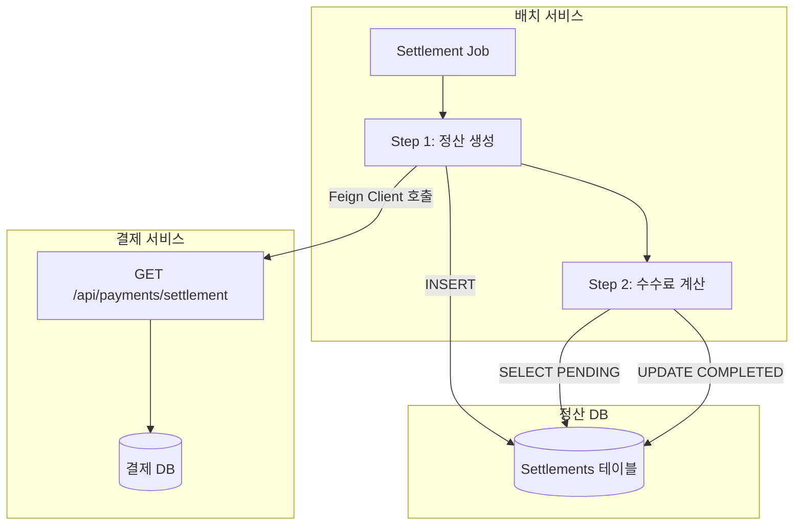
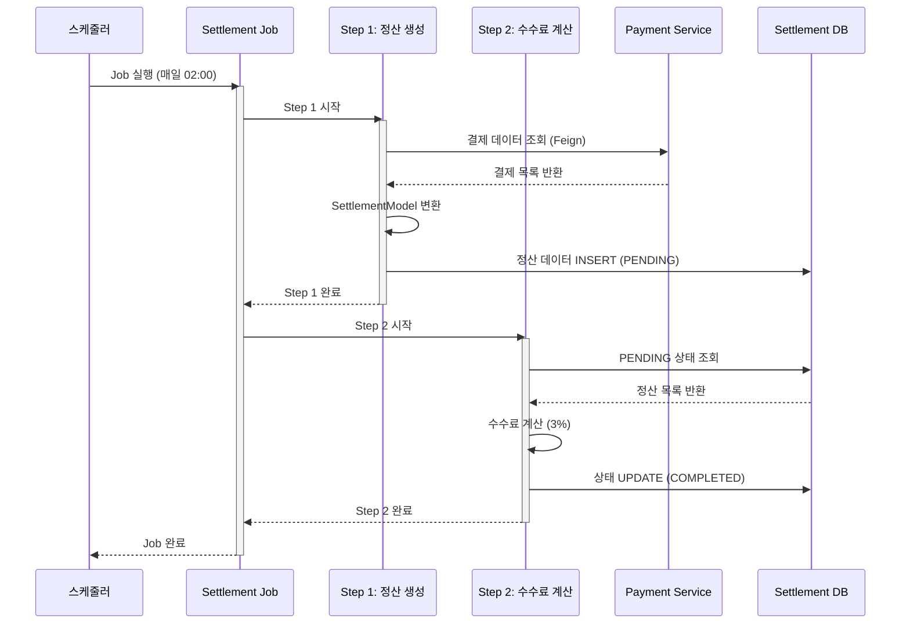
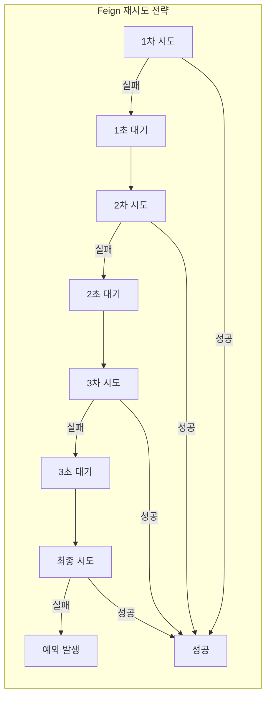
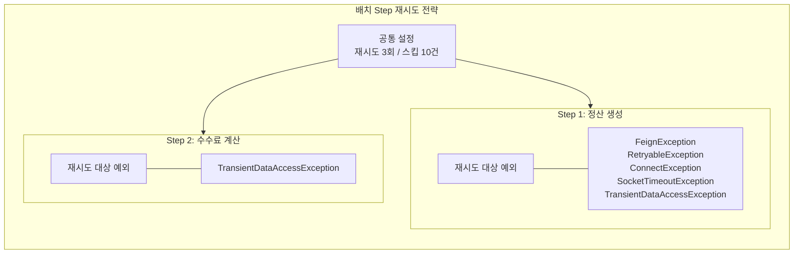
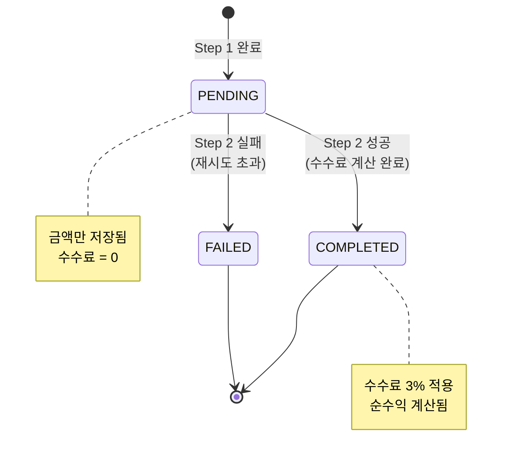
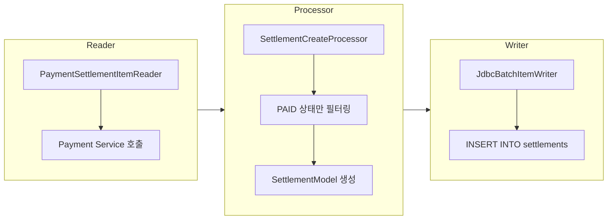
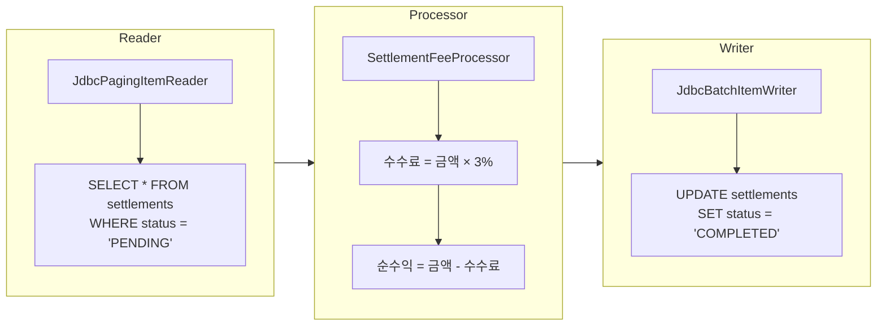
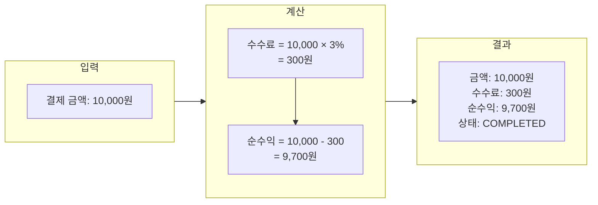
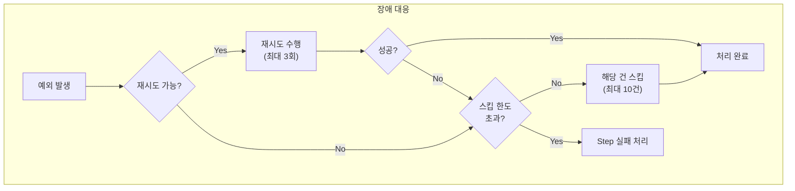

# 정산 배치 시스템 아키텍처

## 📌 개요

본 발표자료는 Spring Batch 기반의 **정산 배치 시스템**에 대해 설명합니다.
결제 데이터를 조회하여 정산 데이터를 생성하고, 수수료를 계산하는 일괄 처리 시스템입니다.

---

## 🏗️ 시스템 아키텍처

---

## 📊 배치 Job 흐름

---

## 🔄 재시도 전략

### Feign 클라이언트 재시도

| 설정 항목 | 값 | 설명 |
|----------|-----|------|
| 최대 재시도 | 3회 | 초기 호출 포함 총 4회 시도 |
| 초기 대기 시간 | 1초 | 첫 번째 재시도 전 대기 |
| 최대 대기 시간 | 3초 | 재시도 간 최대 대기 시간 |
| 연결 타임아웃 | 5초 | 서버 연결 제한 시간 |
| 읽기 타임아웃 | 10초 | 응답 수신 제한 시간 |

---

### 배치 Step 재시도

---

## 📈 정산 데이터 상태 흐름

---

## 🛠️ 핵심 컴포넌트

### 1. SettlementCreateStep (정산 생성)

### 2. SettlementFeeStep (수수료 계산)

---

## 🔧 기술 스택

| 구분 | 기술 |
|------|------|
| 프레임워크 | Spring Boot 3.5.7 |
| 배치 처리 | Spring Batch 5.x |
| HTTP 클라이언트 | OpenFeign |
| 데이터베이스 | MySQL / H2 (테스트) |
| 빌드 도구 | Gradle |
| Java 버전 | 21 (LTS) |

---

## 📋 수수료 계산 예시

---

## 🚨 장애 대응 전략

| 장애 유형 | 대응 방식 |
|----------|----------|
| 네트워크 일시 장애 | Feign 재시도 (3회) + Step 재시도 (3회) |
| Payment Service 다운 | 연결 타임아웃 후 재시도, 최종 실패 시 스킵 |
| DB 락 충돌 | TransientDataAccessException 재시도 |
| 데이터 오류 | 해당 건 스킵 (최대 10건) |

---

## 📊 모니터링 포인트

- **Job 실행 상태**: COMPLETED / FAILED
- **처리 건수**: 읽기/쓰기/스킵 건수
- **실행 시간**: Step별 소요 시간
- **재시도 횟수**: Feign / Batch 재시도 로그

---

## 🎯 요약

> **정산 배치 시스템**은 결제 데이터를 기반으로 정산 데이터를 생성하고 수수료를 계산하는 **2-Step 배치 Job**입니다.

### 핵심 특징

1. ✅ **멀티 레벨 재시도**: Feign 클라이언트 + Batch Step 이중 보호
2. ✅ **Fault Tolerant**: 일부 실패해도 나머지 처리 계속
3. ✅ **청크 기반 처리**: 1,000건 단위로 트랜잭션 관리
4. ✅ **스케줄링**: 매일 02:00 자동 실행

---

*발표자료 생성일: 2025-12-11*
