## 🥔 **연근마켓**

프로그래머스 백엔드 심화과정 1기 **Ctrl+Z 팀**의 백엔드 프로젝트입니다.

### 👥 Member
|                **김상아**                 |                   **옥정현**                   |                 **이준호**                  |                 **최민석**                  |
| :-----------------------------------------: | :-----------------------------------------: | :-----------------------------------------: | :-----------------------------------------: |
|  |  |  |  |
|                 **PO**                 |                     **BE**                     |                   **BE**                    |                   **BE**                    |
|   [GitHub](https://github.com/shark-coding)    |   [GitHub](https://github.com/okjunghyeon)    |   [GitHub](https://github.com/iamian815)    |   [GitHub](https://github.com/choizz156)    |

---

### 📌 프로젝트명


**yeongeunMarket — 중고 상품 거래 이커머스 플랫폼**

### 📚 프로젝트 소개

> **개인 간 신뢰 기반의 중고거래 플랫폼**  
> 예치금 시스템과 실시간 검색을 갖춘 안전한 거래 환경 제공  
> Spring Cloud MSA + Kafka + Elasticsearch + Toss Payments 기반 실무형 프로젝트

#### 🎯 문제점 및 학습 목표
- 키워드 기반 실시간 검색 및 자동완성 품질/속도의 한계 (RDB 기반 검색)
- 모놀리식 구조의 장애 전파와 확장성 부족
- 중고거래 결제·정산 시 발생하는 금액 문제 해결
- 배치 프로세스의 대용량 처리, 효율적 정산 관리 필요

#### 🏗️ 기술 적용
- **Elasticsearch**: 대용량 데이터 실시간 검색·자동완성, More Like This 유사 상품 추천, Function Score 기반 일일 추천
- **Spring Cloud MSA**: 6개 도메인 서비스 분리 및 독립 운영, 장애 전파 최소화
- **Kafka 이벤트 설계**: 주문-결제-정산 등 도메인 간 비동기 통신, 느슨한 결합 및 확장
- **예치금 결제 시스템 & Toss 연동**: 복합 결제(예치금+PG) 프로세스 직접 구현, 멱등성 보장
- **Spring Batch**: 대용량 데이터 배치 처리, 정산 자동화 (PENDING → WAITING → COMPLETED)
- **CI/CD & Kubernetes**: GitHub Actions와 쿠버네티스로 자동화된 무중단 배포
- **OAuth2 인증**: 구글 로그인 연동, JWT 기반 토큰 관리 (HttpOnly Cookie)

---

## 🚀 주요 기능

### 📊 API 통계
**총 약 80개의 REST API** 구현 (Swagger 문서화 완료)

| 서비스 | API 개수 | 포트 | 주요 기능 |
|--------|----------|------|-----------|
| **Gateway Service** | - | 8082 | API 라우팅, 인증 |
| **Account Service** | 14개 | 8080 | 회원, 인증, 판매자 권한 |
| **Domain Service** | 50개+ | 8081 | 상품, 주문, 리뷰, 장바구니 |
| **Payment Service** | 8개 | 8083 | 결제, 환불, 예치금 |
| **Batch Service** | 5개 | 8085 | 정산, 검색 배치 |
| **AI Service** | 1개 | 8084 | AI 추천 |
| **Discovery Service** | - | 8761 | Eureka 서비스 디스커버리 |

<details>
<summary><h3>🔐 Account Service - 회원 및 인증</h3></summary>

#### 인증 (Auth)
- [x] OAuth 2.0 Google 로그인 (isNewUser 분기 처리)
- [x] Access Token 재발급 (Refresh Token 기반)
- [x] 로그아웃 (Redis Token 삭제 + Cookie 만료)
- [x] JWT 토큰 관리 (HttpOnly Cookie 방식)

#### 회원 관리 (User)
- [x] 회원가입 (가입 시 토큰 자동 발급)
- [x] 회원정보 조회 (내 정보 / 특정 사용자)
- [x] 회원정보 수정 (닉네임, 전화번호, 주소)
- [x] 프로필 이미지 관리 (S3 업로드/교체)

#### 판매자 권한
- [x] SMS 인증 코드 발송 (6자리)
- [x] 인증 코드 검증 후 SELLER 권한 부여

</details>

<details>
<summary><h3>🛍️ Domain Service - 핵심 비즈니스</h3></summary>

#### 상품 게시글 (ProductPost)
- [x] 상품 게시글 CRUD (이미지 포함)
- [x] 상품 목록 조회 (전체/내 게시글/카테고리별)
- [x] 거래 상태 관리 (SELLING → PROCESSING → SOLDOUT)
- [x] 조회수 증가 및 본인 여부 확인
- [x] Soft Delete 방식 삭제

#### 카테고리 & 태그
- [x] 카테고리 CRUD
- [x] 태그 CRUD
- [x] 상품-카테고리-태그 연관 관계 관리

#### 관심 상품 (Favorite)
- [x] 찜하기 (좋아요) 등록/취소
- [x] 관심 상품 목록 조회
- [x] 찜 개수 실시간 집계

#### 장바구니 (Cart)
- [x] 장바구니 생성 및 조회
- [x] 상품 추가/삭제
- [x] 선택 상태 변경 (결제 대상 선택)

#### 주문 (Order)
- [x] 주문 생성 (장바구니 기반)
- [x] 주문 상세 조회
- [x] 구매자/판매자 주문 목록
- [x] 주문 상태 관리 (PAYMENT_PENDING → PAYMENT_COMPLETED → PURCHASE_CONFIRMED → SETTLED)
- [x] 구매 확정 처리
- [x] 주문 취소

#### 리뷰 (Review)
- [x] 리뷰 작성 (구매 완료 상품 대상)
- [x] 리뷰 CRUD
- [x] 상품별/사용자별 리뷰 조회
- [x] 2종 평점 시스템 (판매자 평점 + 상품 평점)

</details>

<details>
<summary><h3>🔍 Search Service - Elasticsearch 검색</h3></summary>

#### 상품 검색 (ProductPost Search)
- [x] 통합 검색 (키워드 기반)
- [x] 유사 상품 추천 (More Like This Query)
- [x] 오늘의 추천 상품 (Function Score)
- [x] 판매자 정보 조회 및 추천
- [x] 다중 필터링 (카테고리/가격/상태)

#### 검색어 관리 (Search Word)
- [x] 검색어 저장 (Redis)
- [x] 자동완성 (접두사 매칭)
- [x] 최근 검색어 조회 (개인별 최대 10개)
- [x] 최근 검색어 삭제 (개별/전체)
- [x] 인기 검색어 Top N
- [x] AI 추천 시스템 연동 (검색 패턴 이벤트 발행)

</details>

<details>
<summary><h3>💳 Payment Service - 결제 및 예치금</h3></summary>

#### 결제 (Payment)
- [x] 결제 준비 정보 조회 (주문 금액 + 예치금 잔액)
- [x] Toss Payments 결제 승인
- [x] 예치금 전액 결제
- [x] 복합 결제 (예치금 + Toss)
- [x] 결제 환불 (자동 분기: Toss/예치금/복합)
- [x] 멱등성 보장 (중복 결제 방지)
- [x] 정산용 결제 내역 조회

**결제 타입**
- `TOSS`: Toss Payments 전액
- `DEPOSIT`: 예치금 전액
- `DEPOSIT_TOSS`: 복합 결제

#### 예치금 (Deposit)
- [x] 예치금 계좌 생성 (초기 잔액 0원)
- [x] 예치금 잔액 조회 (없으면 자동 생성)
- [x] Toss 연동 충전 확정
- [x] 결제 시 예치금 우선 차감
- [x] 환불 시 예치금 자동 복구

</details>

<details>
<summary><h3>💰 Batch Service - 정산 및 배치</h3></summary>

#### 정산 관리 (Settlement)
- [x] 정산 내역 조회 (개별/목록/사용자별)
- [x] 정산 삭제
- [x] Payment Service 연동 조회

#### 정산 배치 (Spring Batch)
- [x] 정산 배치 수동 실행 (특정 기간)
- [x] 판매자별 정산 금액 계산
- [x] 상태 관리 (PENDING → WAITING → COMPLETED/FAILED)
- [x] 실패 시 재시도 로직

**정산 프로세스**
```
구매 확정 → SettlementCreatedEvent → PENDING 생성
→ 배치 실행 (100건씩) → DepositSettlementReadyEvent
→ 예치금 처리 → SettlementResultEvent → COMPLETED/FAILED
```

#### 검색 이력 배치
- [x] Spring Batch 기반 검색 이력 처리
- [x] 수동 트리거 방식 지원

</details>

<details>
<summary><h3>🤖 AI Service - 상품 추천</h3></summary>

- [x] Spring AI 기반 개인화 추천
- [x] 쿼리 기반 상품 추천 생성
- [x] 사용자 검색 패턴 분석
- [x] Elasticsearch 연동 유사 상품 검색

</details>

---

## 🛠 기술 스택

### 💻 Language


### ⚙ Framework & Library


### 🗄 Database & Search


### 🛠 Infra


### 🌐 MSA & Messaging


### 🔧 Collaboration Tools


---

## 🏛️ 시스템 아키텍처

### 마이크로서비스 구조

```
                    ┌─────────────────┐
                    │ Discovery Svc   │ ← Eureka (Port 8761)
                    │  Service 등록   │
                    └────────┬────────┘
                             │
                    ┌────────▼────────┐
                    │  API Gateway    │ ← Spring Cloud Gateway
                    │   (Port 8082)   │    인증 & 라우팅
                    └────────┬────────┘
                             │
         ┌───────────────────┼───────────────────┬──────────────┬──────────────┐
         │                   │                   │              │              │
    ┌────▼─────┐      ┌─────▼──────┐      ┌────▼──────┐  ┌───▼──────┐  ┌───▼──────┐
    │ Account  │      │   Domain   │      │  Payment  │  │  Batch   │  │    AI    │
    │ Service  │      │  Service   │      │  Service  │  │ Service  │  │ Service  │
    │  :8080   │      │   :8081    │      │   :8083   │  │  :8085   │  │  :8084   │
    └────┬─────┘      └─────┬──────┘      └────┬──────┘  └───┬──────┘  └───┬──────┘
         │                  │                   │             │             │
         └──────────────────┴───────────────────┴─────────────┴─────────────┘
                                        │
                                ┌───────┴───────┐
                                │  Kafka Event  │ ← Port 9090
                                │      Bus      │
                                └───────────────┘
```

### 주요 통신 패턴
1. **Gateway → Services**: 라우팅 및 `X-REQUEST-ID` 헤더 전달
2. **Domain ↔ Payment**: Feign Client (주문-결제 연동)
3. **Domain → Elasticsearch**: 상품 검색 (More Like This, Function Score)
4. **Services → Kafka**: 비동기 이벤트 발행 (주문, 정산, 검색 패턴)
5. **Batch ← Payment**: 배치 조회 (정산 데이터)

---

## 🐳 컨테이너 환경

### Docker Compose 구성

프로젝트는 다음과 같은 컨테이너 환경에서 운영됩니다:

| 컨테이너 | 이미지 | 포트 | 용도 |
|----------|--------|------|------|
| **Redis** | redis:latest | 6379 | 토큰 관리, 검색어 캐싱, 최근 본 상품 |
| **Elasticsearch** | eddie1031/es:9.1.3 | 9200 | 상품 검색 엔진 |
| **Logstash** | eddie1031/ls:9.1.3 | 5044 | MySQL → ES 데이터 동기화 |
| **Kibana** | kibana:9.1.3 | 5601 | Elasticsearch 모니터링 대시보드 |
| **Kafka** | apache/kafka | 9090 | 이벤트 기반 메시징 (주문, 정산) |
| **Kafka UI** | provectuslabs/kafka-ui | 8085 | Kafka 토픽/메시지 모니터링 |
| **MySQL** | mysql | 3307→3306 | 메인 데이터베이스 |
| **Zipkin** | openzipkin/zipkin | 9411 | 분산 추적 (Distributed Tracing) |

### 주요 특징
- **ELK Stack**: Elasticsearch + Logstash + Kibana로 검색 및 로그 분석
- **Kafka Ecosystem**: Kafka + Kafka UI로 이벤트 기반 아키텍처 구현
- **Zipkin**: MySQL 백엔드 스토리지로 마이크로서비스 간 요청 추적
- **Health Check**: MySQL 컨테이너 헬스체크로 의존성 순차 시작 보장

---

## 🔑 주요 기술 구현 특징

### 1. 멱등성 보장 시스템
- **결제**: `orderId` 기반 중복 요청 차단
- **정산**: 이벤트 재발행 시 중복 처리 방지

### 2. 복합 결제 처리
```java
// 예치금 우선 차감 → 부족분 Toss 승인
1. 예치금 사용액 차감
2. 남은 금액 Toss로 승인 요청
3. 모두 성공 시 주문 상태 업데이트
4. 실패 시 전체 롤백
```

### 3. Elasticsearch 고급 쿼리
- **More Like This**: 유사 상품 추천
- **Function Score**: 일일 추천 상품 (조회수, 좋아요, 최신성 가중치)
- **Autocomplete**: Nori 형태소 분석기 + Edge NGram

### 4. Spring Batch 배치 처리
- **Chunk 방식**: 100건씩 읽기-처리-쓰기
- **재시도 로직**: FAILED 정산 자동 재처리
- **스케줄링**: Cron 표현식 기반 주기적 실행

### 5. Kafka 이벤트 기반 통신
```
purchase-confirmed → settlement-created
settlement-ready → deposit-processed
settlement-result → settlement-completed/failed
```

### 6. Redis 활용
- **토큰 관리**: Refresh Token 저장 (TTL 설정)
- **검색어**: 최근 검색어 (Sorted Set) + 인기 검색어 (Hash)
- **최근 본 상품**: Sorted Set (zSet)으로 조회 시간 기반 정렬 관리
- **세션**: 인증 코드 임시 저장 (5분 TTL)

---

## 📊 플로우 차트

### 🔐 인증 & 회원 관리

<details>
<summary>회원가입</summary>

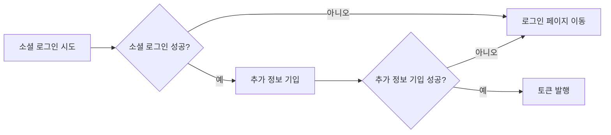
</details>

<details>
<summary>로그인</summary>

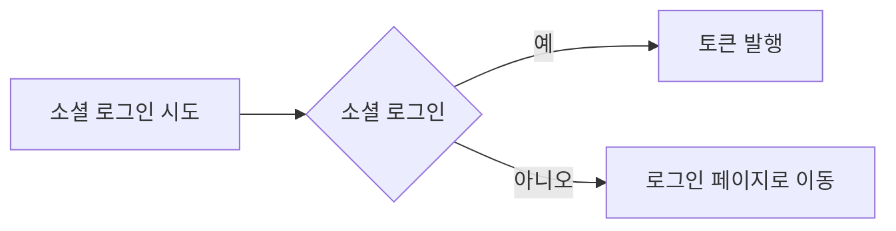
</details>

<details>
<summary>로그아웃</summary>

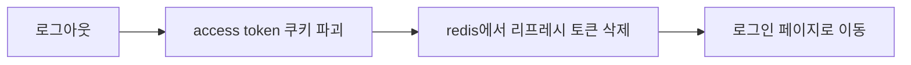
</details>

<details>
<summary>Access Token 재발급</summary>

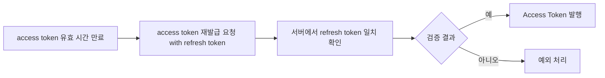
</details>

<details>
<summary>판매자 등록</summary>

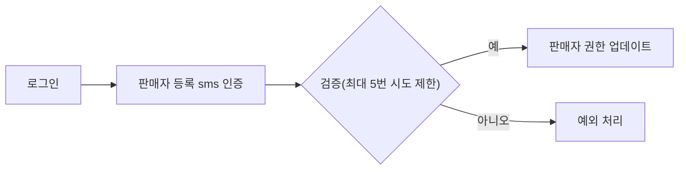
</details>

---

### 🛍️ 상품 관리

<details>
<summary>상품 등록</summary>

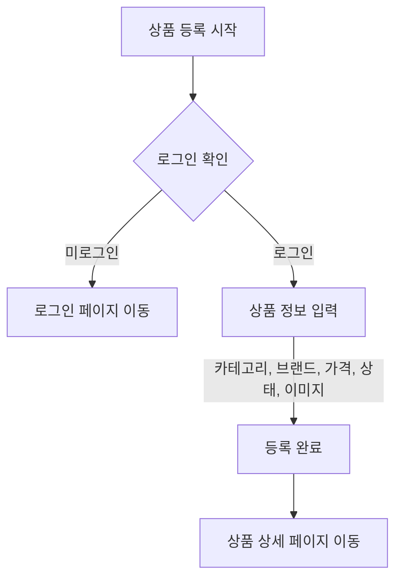
</details>

<details>
<summary>상품 조회 및 구매</summary>

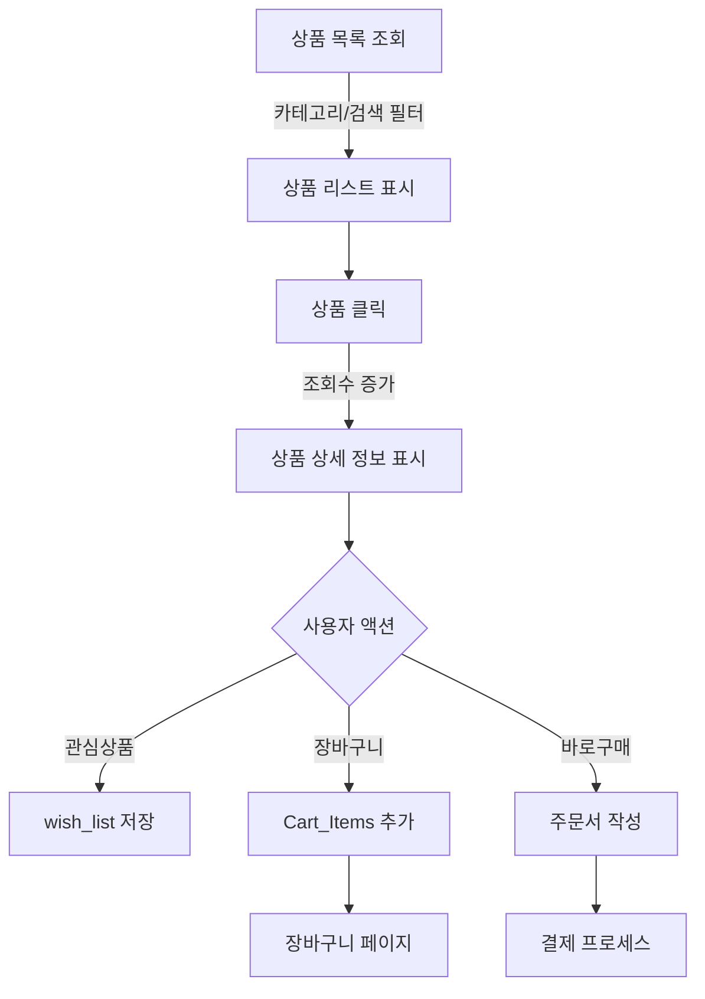
</details>

<details>
<summary>상품 검색</summary>

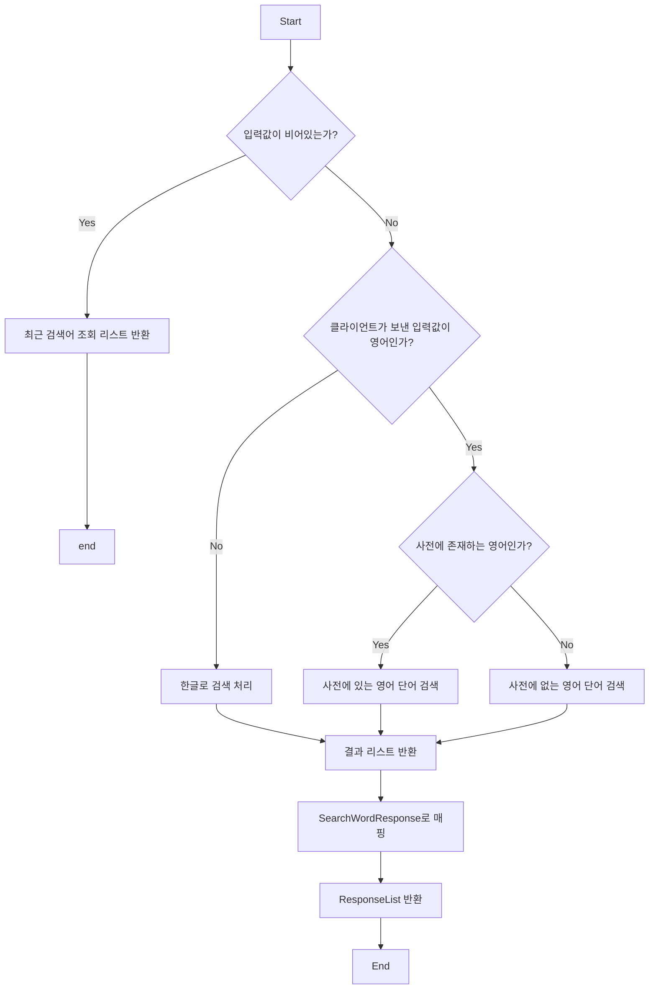
</details>

<details>
<summary>상품 문의</summary>

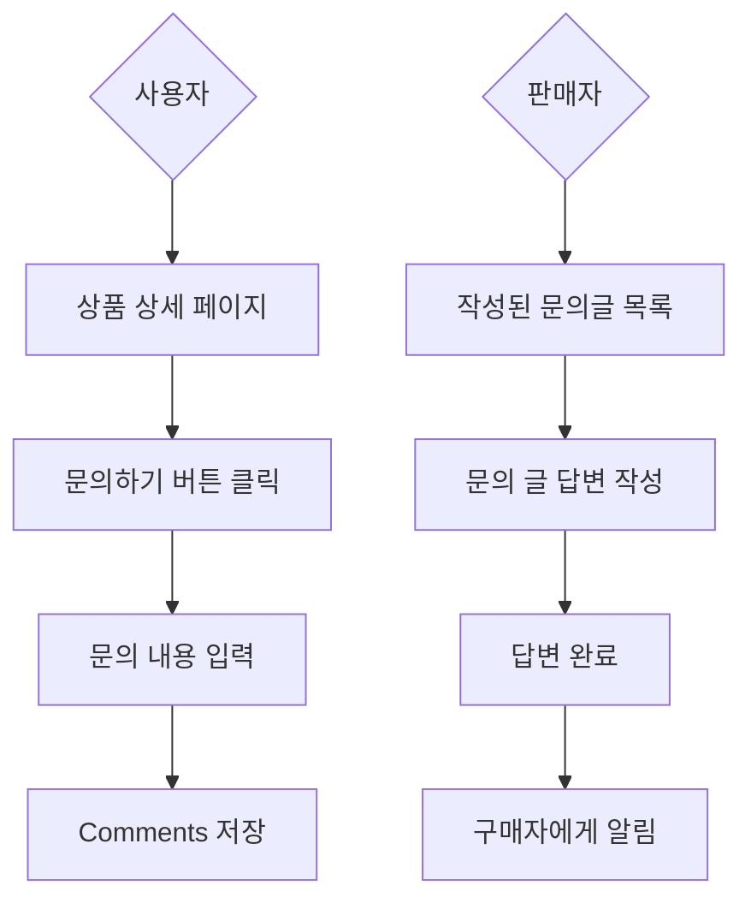
</details>

---

### 💳 결제 & 정산

<details>
<summary>결제</summary>

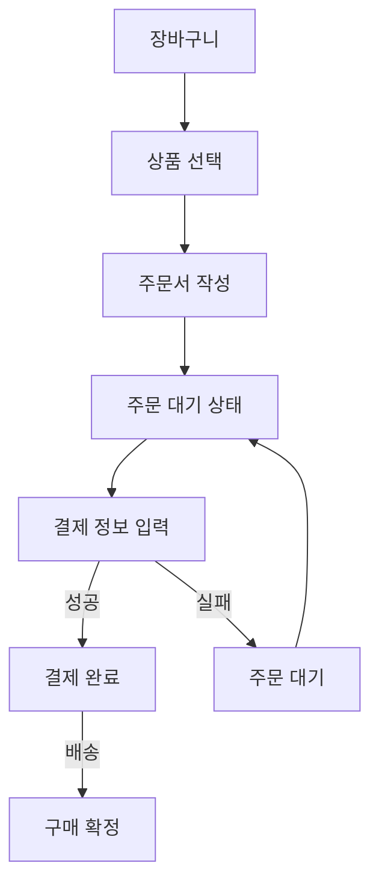
</details>

<details>
<summary>결제 시스템 (상태 관리)</summary>

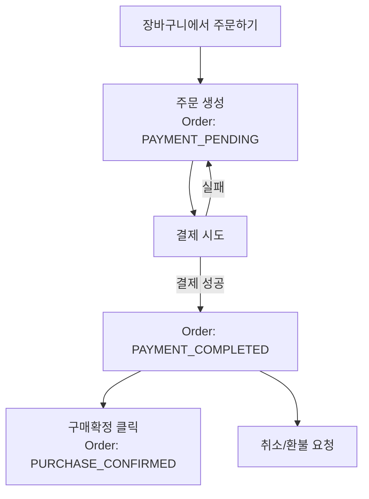

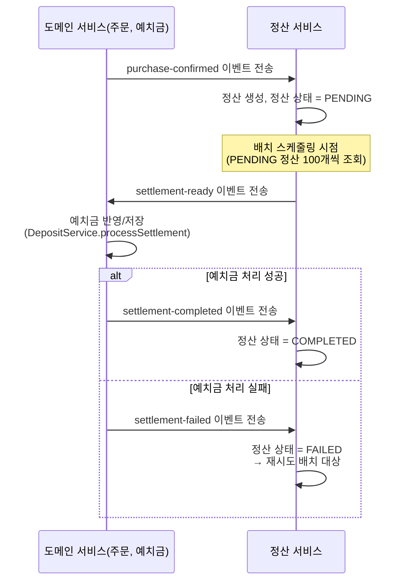
</details>

<details>
<summary>정산 (Spring Batch)</summary>

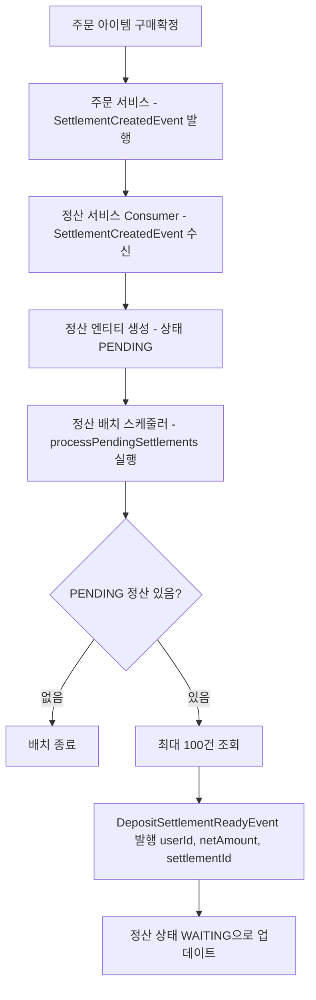

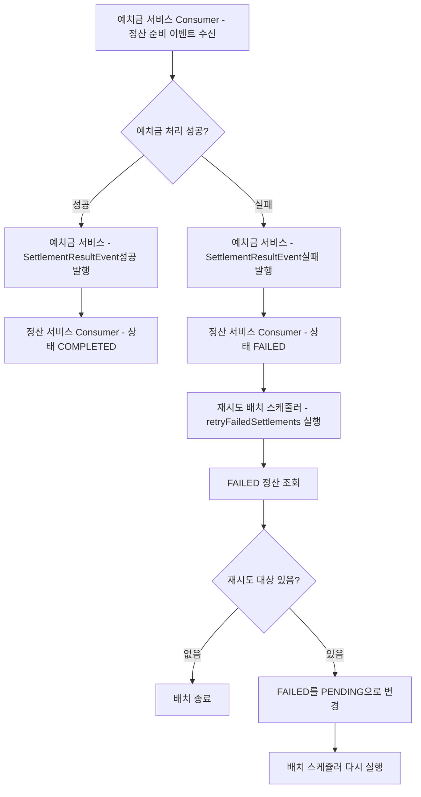
</details>

---

### ⭐ 리뷰

<details>
<summary>판매자 리뷰</summary>

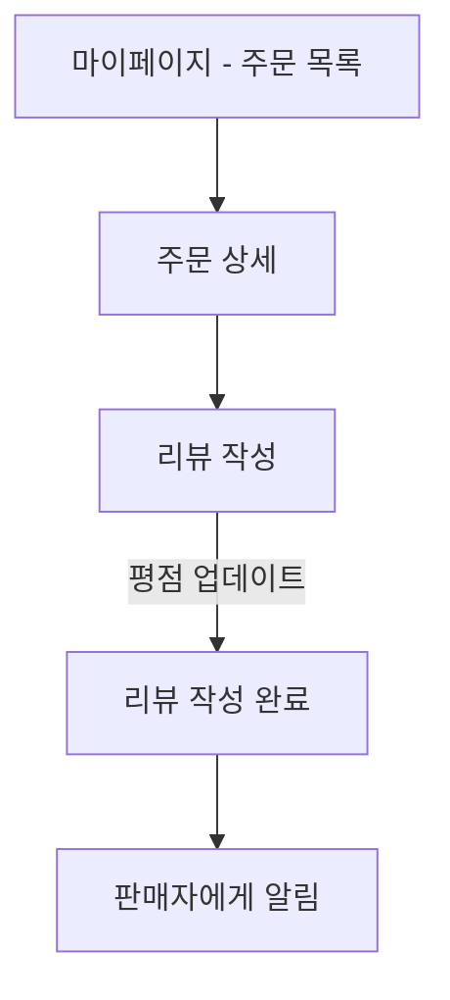
</details>

---

## 📄 추가 문서

### 🔗 ERD


### 🏛️ 백엔드 아키텍처


### 📜 프로젝트 기획서
- [프로젝트 기획서 바로가기](https://www.notion.so/29f9d0051b9981e6a1a7d5421fd58f1e?source=copy_link)

### 📌 API 명세서
- [API 명세서 바로가기](https://www.notion.so/API-Mock-Server-29f9d0051b99813299b8e88a68ac724c?source=copy_link)

### 기능 정의서
- [기능 정의서 바로가기](https://www.notion.so/29f9d0051b9981438f59c43ef83877d6?source=copy_link)

---

## 🙏 회고

이 프로젝트를 통해 MSA 환경에서의 **이벤트 기반 아키텍처**, **복합 결제 시스템**, **Elasticsearch 검색 최적화**, **Spring Batch 배치 처리** 등 실무에서 중요한 기술들을 학습하고 적용할 수 있었습니다.

특히 **약 80개의 API를 6개의 마이크로서비스로 분리**하여 독립적으로 운영하면서, Kafka를 통한 느슨한 결합과 Spring Cloud Gateway를 통한 효율적인 라우팅을 경험했습니다.

---

**Made with ❤️ by Team Ctrl+Z**