# 🥔 연근마켓

프로그래머스 백엔드 심화과정 1기 **Ctrl+Z 팀**의 백엔드 프로젝트입니다.

### 👥 Member

|                **김상아**                 |                   **옥정현**                   |                   **이건민**                   |                 **이준호**                  |                 **최민석**                  |
| :-----------------------------------------: | :-----------------------------------------: | :-----------------------------------------: | :-----------------------------------------: | :-----------------------------------------: |
|  |  |  |  |  |
|                 **PO**                 |                     **BE**                     |                     **BE**                     |                   **BE**                    |                   **BE**                    |
|   [GitHub](https://github.com/shark-coding)    |   [GitHub](https://github.com/okjunghyeon)    |   [GitHub](https://github.com/Leegeonmin)    |   [GitHub](https://github.com/iamian815)    |   [GitHub](https://github.com/choizz156)    |


---

### 📌 1. 프로젝트명
**yeongeunMarket — 중고 상품 거래 이커머스 플렛폼**


### 📚 2. 프로젝트 소개
> 123

### 🚀 3. 주요 기능
- [ ] 회원가입 / 로그인 (이메일 인증)
- [ ] 2

## 🛠 기술 스택

### 💻 Language


### ⚙ Framework & Library


### 🗄 Database


### 🛠 Development Tools


### 🔧 Collaboration Tools


---
## 📄 추가 문서

### 🔗 ERD
<details>
  <summary>ERD 보기</summary>
  


</details>

### 📜 프로젝트 기획서
- [프로젝트 기획서 바로가기](https://www.notion.so/29f9d0051b9981e6a1a7d5421fd58f1e?source=copy_link)

### 📌 API 명세서
- [API 명세서 바로가기](https://www.notion.so/API-Mock-Server-29f9d0051b99813299b8e88a68ac724c?source=copy_link)

### 플로우 차트

<details>
  <summary>플로우 차트 보기</summary>

  ```mermaid


프로그래머스 백엔드 심화과정 1기 **Ctrl+Z 팀**의 백엔드 프로젝트입니다.

### 👥 Member

|                **김상아**                 |                   **옥정현**                   |                   **이건민**                   |                 **이준호**                  |                 **최민석**                  |
| :-----------------------------------------: | :-----------------------------------------: | :-----------------------------------------: | :-----------------------------------------: | :-----------------------------------------: |
|  |  |  |  |  |
|                 **PO**                 |                     **BE**                     |                     **BE**                     |                   **BE**                    |                   **BE**                    |
|   [GitHub](https://github.com/shark-coding)    |   [GitHub](https://github.com/okjunghyeon)    |   [GitHub](https://github.com/Leegeonmin)    |   [GitHub](https://github.com/iamian815)    |   [GitHub](https://github.com/choizz156)    |


---

### 📌 프로젝트명


**yeongeunMarket — 중고 상품 거래 이커머스 플렛폼**


### 📚 프로젝트 소개

> **개인 간 신뢰 기반의 중고거래 플랫폼**  
> 예치금 시스템과 실시간 검색을 갖춘 안전한 거래 환경 제공  
> Spring Cloud MSA + Kafka + Elasticsearch + Toss Payments 기반 실무형 프로젝트


#### 🎯 문제점 및 학습 목표
- 키워드 기반 실시간 검색 및 자동완성 품질/속도의 한계 (RDB 기반 검색)
- 모놀리식 구조의 장애 전파와 확장성 부족
- 중고거래 결제·정산 시 발생하는 금액 문제 해결
- 배치 프로세스의 대용량 처리, 효율적 정산 관리 필요


#### 🏗️ 기술 적용
- **Elasticsearch**: 대용량 데이터 실시간 검색·자동완성  
- **Spring Cloud MSA**: 5개 이상 도메인 서비스 분리 및 독립 운영, 장애 전파 최소화  
- **Kafka 이벤트 설계**: 주문-결제-정산 등 도메인 간 비동기 통신, 느슨한 결합 및 확장  
- **예치금 결제 시스템 & Toss 연동**: 안전 결제 프로세스 직접 구현  
- **SpringBatch**: 대용량 데이터 배치 처리, 정산 자동화  
- **CI/CD & Kubernetes**: GitHub Actions와 쿠버네티스로 자동화된 무중단 배포  
- **OAuth2 인증**: 구글 로그인 등 외부 인증 연동 경험

***

### 🚀 주요 기능

#### 👤 회원 관리
- [x] 회원가입 / 로그인 (OAuth 2.0 Google)
- [x] 회원정보 조회 및 수정
- [x] 프로필 이미지 관리
- [x] 회원탈퇴
- [x] 액세스 토큰 재발급

#### 🛍️ 상품 관리
- [x] 상품 게시글 CRUD (작성, 조회, 수정, 삭제)
- [x] 상품 게시글 목록 조회
- [x] 카테고리 및 태그 관리
- [x] 최근 조회 상품 목록 (Redis zSet)

#### 🔍 검색 기능 (Elasticsearch)
- [x] 통합 상품 검색
- [x] 검색어 자동완성

#### 🛒 장바구니
- [x] 장바구니 CRUD
- [x] 장바구니 상품 추가/삭제
- [x] 장바구니 아이템 선택/해제

#### 📦 주문 관리
- [x] 주문 생성 및 조회
- [x] 주문 확정
- [x] 주문 취소 (전체/부분)

#### 💳 결제
- [x] 결제 준비 및 승인 (Toss Payments 연동)
- [x] 예치금 결제
- [x] 결제 취소 및 환불
- [x] 결제 성공/실패 처리

#### 💰 정산
- [x] 판매자별 정산 목록 조회
- [x] 정산 상세 조회

#### 💵 예치금
- [x] 예치금 조회 및 관리

***

## 🛠 기술 스택

### 💻 Language

---
### ⚙ Framework & Library


---
### 🗄 Database & search


---
### 🛠 Infra


---
### 🌐 MSA & Messaging


---
### 🔧 Collaboration Tools


---

## 📄 추가 문서

### 🔗 ERD
  

### 🏛️ 백엔드 아키텍처


### 📜 프로젝트 기획서
- [프로젝트 기획서 바로가기](https://www.notion.so/29f9d0051b9981e6a1a7d5421fd58f1e?source=copy_link)


### 📌 API 명세서
- [API 명세서 바로가기](https://www.notion.so/API-Mock-Server-29f9d0051b99813299b8e88a68ac724c?source=copy_link)

  
### 기능 정의서
- [기능 정의서 바로가기](https://www.notion.so/29f9d0051b9981438f59c43ef83877d6?source=copy_link)


### 플로우 차트
<details>

***

	
<details>
  <summary>회원가입</summary>
	
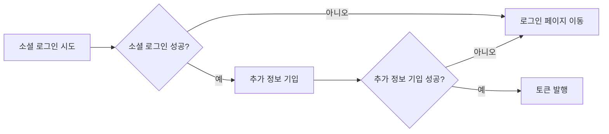
</details>

<details>
  <summary>로그인</summary>
	
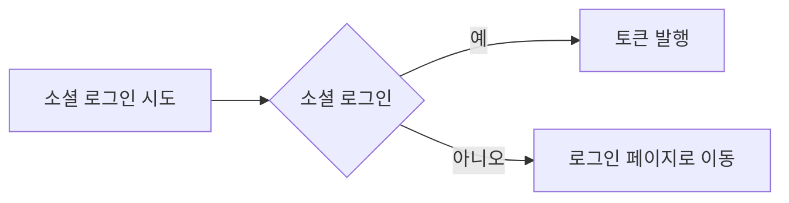
</details>

<details>
  <summary>로그아웃</summary>

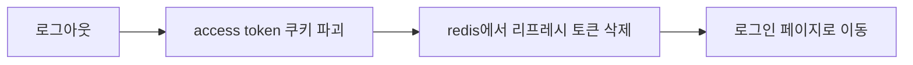
</details>

<details>
  <summary>Access Token 재발급</summary>

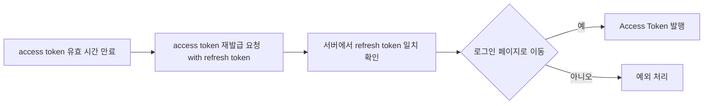
</details>

<details>
  <summary>판매자 등록</summary>

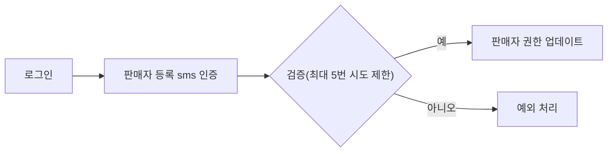
</details>

<details>
  <summary>판매자 리뷰</summary>
	
## 판매자 리뷰 (review)

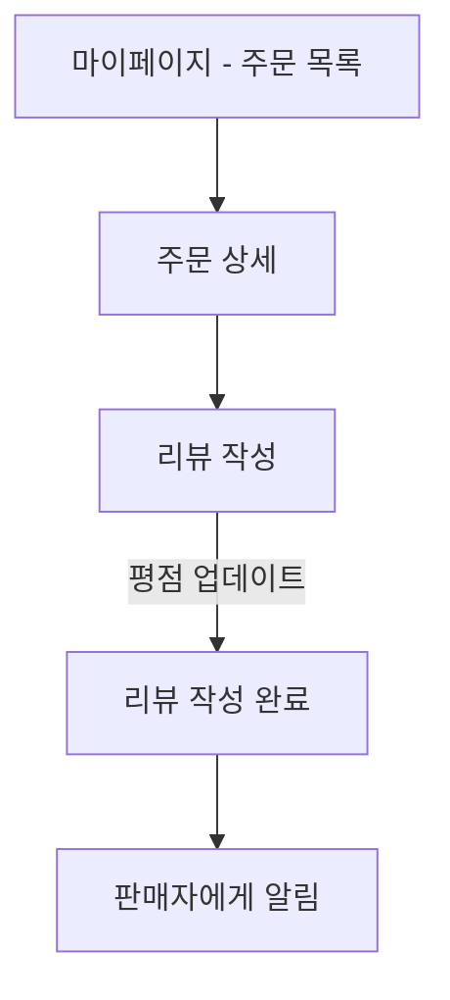
</details>

<details>
  <summary>상품 등록</summary>

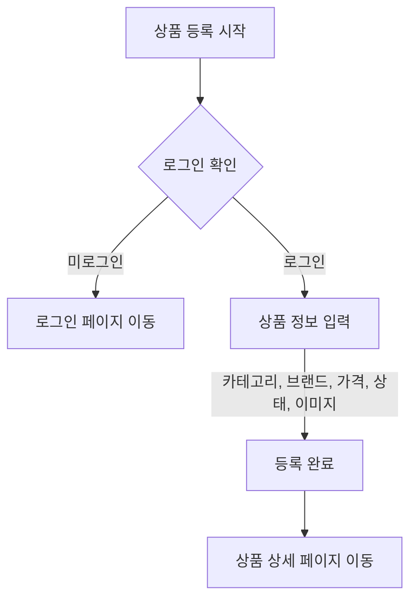
</details>

<details>
  <summary>상품 조회 및 구매</summary>

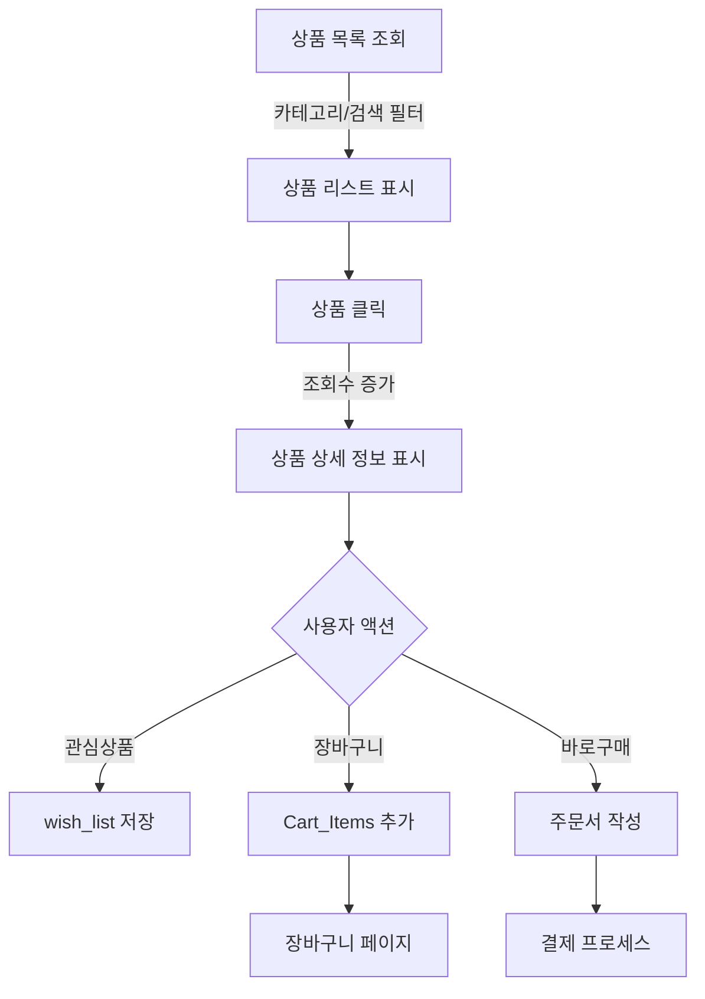
</details>

<details>
  <summary>결제</summary>
	
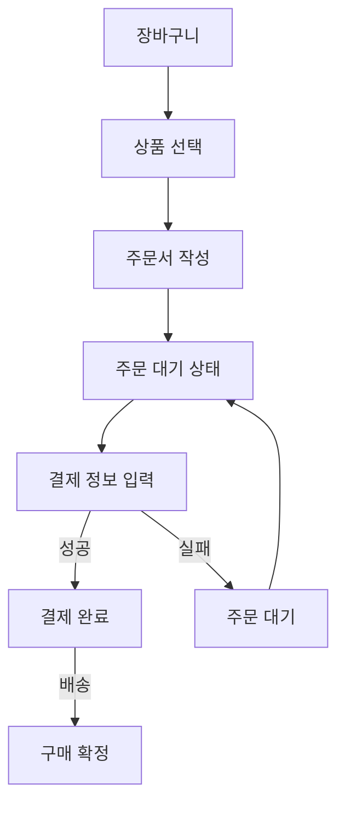
</details>

<details>
  <summary>정산</summary>

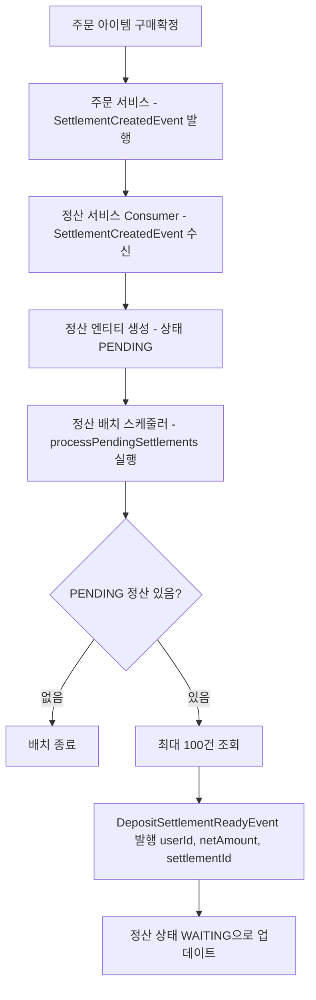

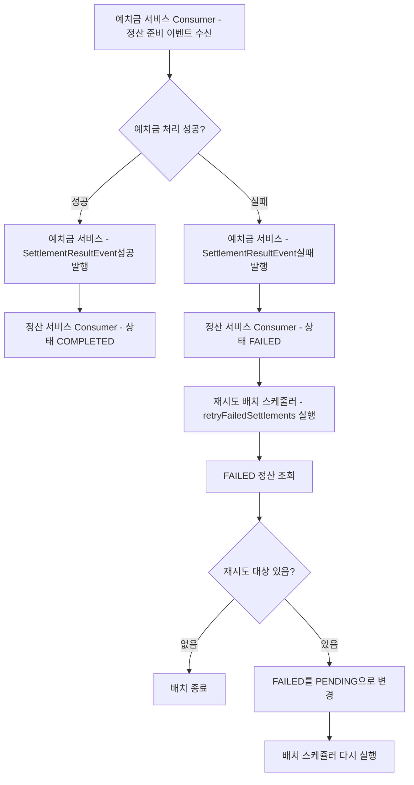

</details>

<details>
  <summary>상품 검색</summary>

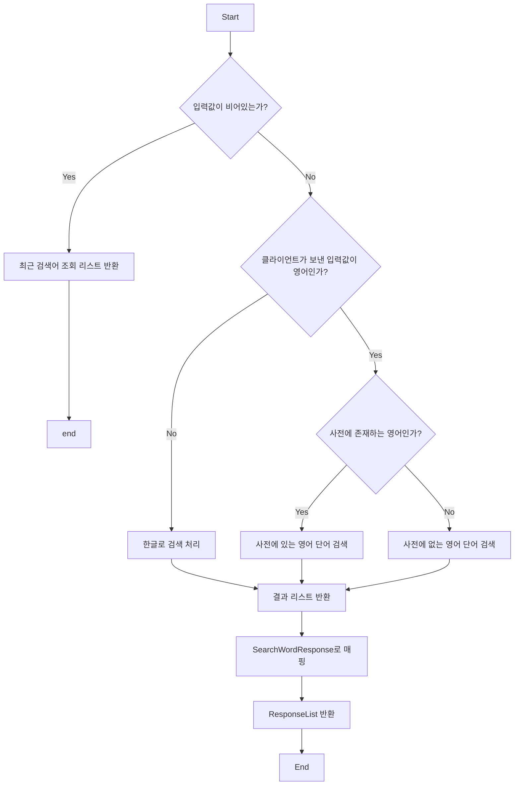

</details>

<details>
  <summary>결제 시스템</summary>

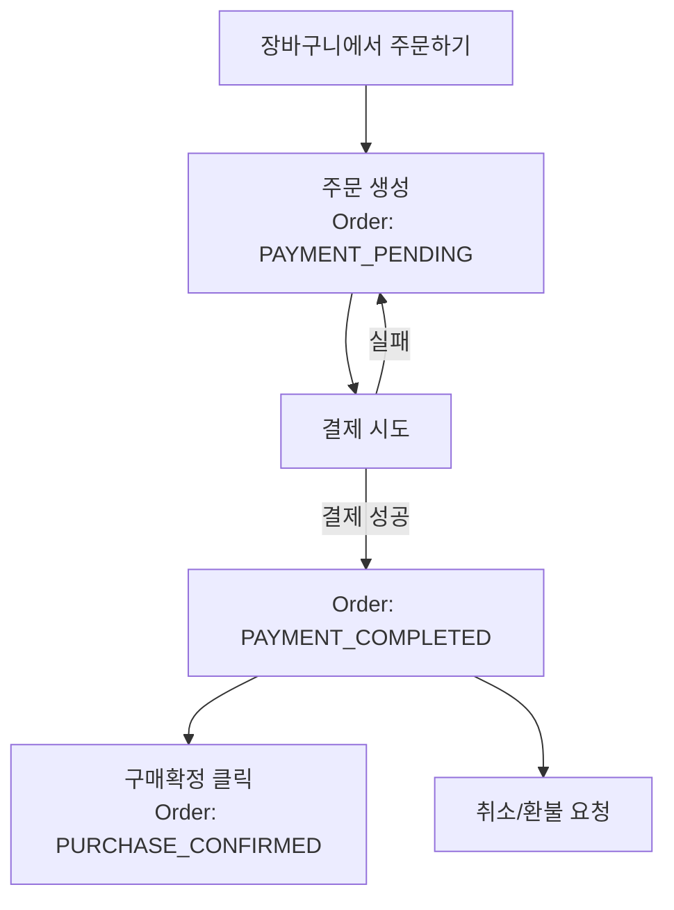

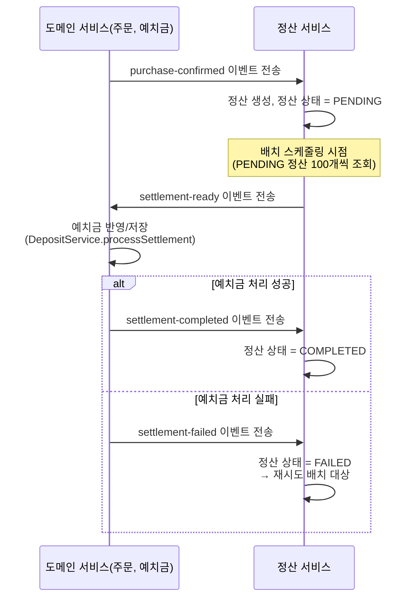

</details>

<details>
  <summary>상품 문의</summary>

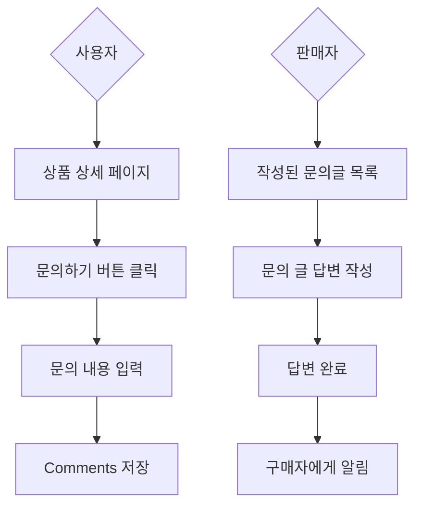
</details>

***

</details>
